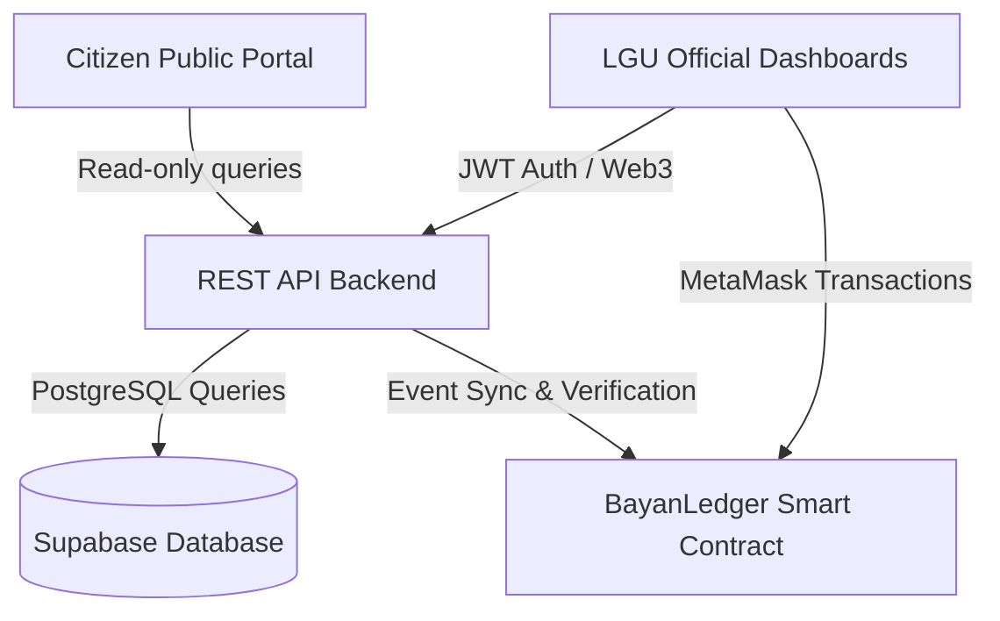

# BayanLedger

> **Decentralized Municipal Project & Budget Transparency Platform**  
> *Immutable, Transparent, Accountable.*

BayanLedger is a blockchain-integrated municipal governance and public expenditure tracking system tailored for local government units (LGUs), specifically designed for the Municipality of Sta. Cruz, Laguna, Philippines. It anchors municipal project milestones, fund allocations, and contractor disbursements onto the Ethereum Sepolia blockchain while providing an accessible, real-time public portal for citizen oversight.

---

## Key Features

- **Multi-Gate Approval Workflow:** Strict role segregation preventing unauthorized budget releases:
  - **MPDC (Municipal Planning & Development Coordinator):** Project creation, milestone planning, deliverable verification, and proof-of-work validation.
  - **Budget Officer:** Fund allocation, budget classification, and recording of Special Allotment Release Orders (SARO).
  - **Municipal Treasurer:** Final fund disbursement processing and Notice of Cash Allocation (NCA) recording on-chain.
  - **System Admin:** Platform user administration, on-chain role grants, and access monitoring.
- **On-Chain Audit Trails:** Critical events (project initialization, fund allocation, milestone verification, payment disbursement) are permanently committed to an Ethereum smart contract (`BayanLedger`).
- **Cryptographic Evidence & Tamper Detection:** Milestones and document attachments are hashed (SHA-256 / IPFS) to identify unauthorized modifications or ledger discrepancies.
- **Public Transparency Portal:** Citizen dashboard displaying active infrastructure projects, allocated budgets, verified disbursement progress, milestone photos, and verifiable blockchain transaction receipts.
- **Comprehensive Reporting & Exporting:** Generates real-time compliance scoreboards, project pipeline summaries, audit logs, and PDF/Excel reports for COA (Commission on Audit) compliance.

---

## System Architecture & Tech Stack



### Components
- **Frontend:** [React 19](https://react.dev/), [TypeScript](https://www.typescriptlang.org/), [Vite](https://vitejs.dev/), [Tailwind CSS v4](https://tailwindcss.com/), [Ethers.js v5](https://docs.ethers.org/v5/), [Lucide React](https://lucide.dev/), [Recharts](https://recharts.org/).
- **Backend API:** [Node.js](https://nodejs.org/) & [Express](https://expressjs.com/), TypeScript (`tsx`), [Supabase](https://supabase.com/) (`@supabase/supabase-js`), [JWT](https://jwt.io/), [Multer](https://github.com/expressjs/multer), Cloudinary storage (optional).
- **Smart Contract:** Solidity `^0.8.20` (`contracts/StaCruzChain.sol`), compiled, tested, and deployed via [Hardhat](https://hardhat.org/) onto the Ethereum Sepolia testnet.
- **Database & Storage:** Supabase PostgreSQL with automated schema migrations, local file upload fallback, and IPFS pinning utilities.

---

## Roles & Access Control

| Role | Responsibility | On-Chain Role Identifier |
| :--- | :--- | :--- |
| **Admin** | Manages official accounts, verifies identities, assigns on-chain roles | `ADMIN_ROLE` |
| **MPDC** | Creates projects, defines milestones, uploads and verifies progress proofs | `MPDC_ROLE` |
| **Budget Officer** | Reviews projects, allocates budgets, records SARO references | `BUDGET_OFFICER_ROLE` |
| **Treasurer** | Authorizes and disburses milestone payments, logs NCA references | `TREASURER_ROLE` |
| **Public / Citizen** | Open access to view projects, budgets, disbursements, and transaction receipts | *None (Read-only)* |

---

## Quickstart & Local Setup

### Prerequisites
- [Node.js](https://nodejs.org/) (v18 or v20 LTS recommended)
- [npm](https://www.npmjs.com/) (v9+)
- [MetaMask](https://metamask.io/) browser extension (connected to Ethereum Sepolia testnet with test ETH)
- A [Supabase](https://supabase.com/) project (PostgreSQL database)

---

### 1. Database Setup
1. Log into your Supabase dashboard and open the **SQL Editor**.
2. Run the SQL schema script located at `backend/supabase/schema.sql`.
3. If backfilling legacy transaction hashes, execute `backend/supabase/backfill-audit-logs-tx-hash.sql`.
4. In Supabase Storage, create a bucket named `project-documents`.

*For detailed instructions, refer to [backend/SUPABASE_SETUP.md](file:///c:/Project%20System/Sta.Cruz%20Chain/backend/SUPABASE_SETUP.md).*

---

### 2. Backend Setup
1. Open a terminal and navigate to the `backend` directory:
   ```bash
   cd backend
   npm install
   ```
2. Create `backend/.env` from `backend/.env.example`:
   ```bash
   cp .env.example .env
   ```
3. Populate required values:
   - `SUPABASE_URL` and `SUPABASE_SERVICE_ROLE_KEY`
   - `JWT_SECRET` (at least 32 characters)
   - `CONTRACT_ADDRESS` (deployed smart contract address)
   - `SEPOLIA_RPC_URL`
4. Start the backend API server (runs on `http://localhost:5000`):
   ```bash
   npm run dev
   ```

---

### 3. Frontend Setup
1. In the root directory, install dependencies:
   ```bash
   npm install
   ```
2. Create `.env` from `.env.example`:
   ```bash
   cp .env.example .env
   ```
3. Configure the frontend environment variables:
   - `VITE_CONTRACT_ADDRESS="<YOUR_DEPLOYED_CONTRACT_ADDRESS>"`
   - `VITE_API_BASE_URL="http://localhost:5000/api"`
4. Start the Vite development server (runs on `http://localhost:3000`):
   ```bash
   npm run dev
   ```

---

### 4. Smart Contract (Hardhat)

Smart contracts and migration scripts are managed through root npm scripts:

- **Compile contracts:**
  ```bash
  npm run hardhat:compile
  ```
- **Run automated test suite:**
  ```bash
  npm run hardhat:test
  ```
- **Deploy to Sepolia:**
  ```bash
  npm run hardhat:deploy:sepolia
  ```
  *(Deployment output will be saved to `artifacts/deployment.latest.json`)*
- **Grant smart contract roles to municipal wallets:**
  ```bash
  npm run hardhat:grant-roles:sepolia
  ```

---

## Project Structure

```text
Sta.Cruz Chain/
├── contracts/               # Solidity smart contracts (BayanLedger)
├── scripts/                 # Hardhat deployment & role assignment scripts
├── test/                    # Contract test suites
├── backend/                 # Express API server
│   ├── src/
│   │   ├── routes/          # API route controllers (projects, milestones, auth, etc.)
│   │   ├── services/        # Tamper detection, blockchain sync, logging
│   │   └── server.ts        # Server entry point
│   ├── supabase/            # SQL schemas and migration scripts
│   └── SUPABASE_SETUP.md    # Database setup guide
├── src/                     # React frontend application
│   ├── components/          # Reusable UI & transparency widgets
│   ├── context/             # AuthContext, BlockchainContext, ThemeContext
│   ├── lib/                 # Web3, IPFS, API client, hashing utilities
│   ├── pages/               # Official dashboards & Public portal pages
│   └── App.tsx              # Main routing configuration
├── DEPLOYMENT.md            # Production deployment checklist
└── FUNCTIONAL_REQUIREMENTS.md # Formal system specification
```

---

## Documentation Index

- [FUNCTIONAL_REQUIREMENTS.md](file:///c:/Project%20System/Sta.Cruz%20Chain/FUNCTIONAL_REQUIREMENTS.md): Complete specifications, requirements (FR-01 to FR-18), user roles, and acceptance criteria.
- [DEPLOYMENT.md](file:///c:/Project%20System/Sta.Cruz%20Chain/DEPLOYMENT.md): Deployment checklist for database, smart contracts, backend, and production considerations.
- [backend/SUPABASE_SETUP.md](file:///c:/Project%20System/Sta.Cruz%20Chain/backend/SUPABASE_SETUP.md): Step-by-step instructions for database configuration and storage buckets.
